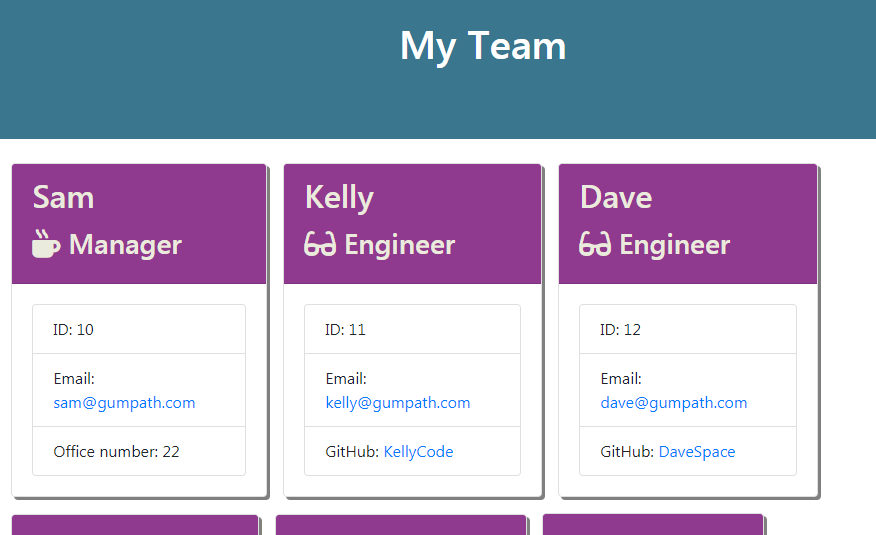

# team-summary


## Description

A customized summary of your team member's basic contact information, built by you!


## Table of Contents
* [Installation](#installation)
* [Usage](#usage)
* [License](#license)
* [Questions](#questions)


## Installation
Install with ``` npm i ```


## Usage

Run ```npm start``` to launch the application. Follow the on-screen prompts to choose a team member's role, name, ID, email, and additional information depending on their role. 

Once you have entered all members of your team, select 'no' when prompted. An HTML file will then be available in the output folder with a summary of your team.



## Links

[GitHub repository](https://github.com/Athear/team-summary)

[Demonstration video](https://drive.google.com/file/d/1yAQ4D4fiLIpuWxh8jGWzqVildA74CK1h/view)


## License

 Licensed under the [MIT](https://spdx.org/licenses/MIT.html) license.


## Questions

For additional questions, find me on [GitHub](https://github.com/athear) or email me at toddomalone@gmail.com.

